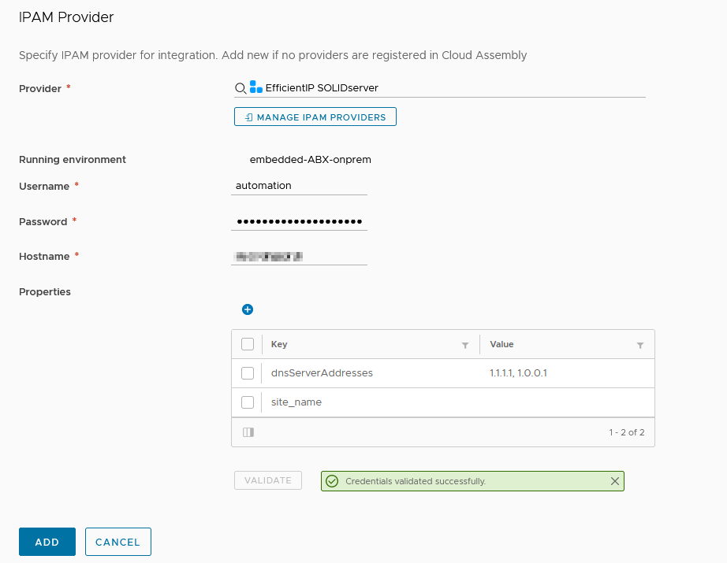

EfficientIP SOLIDserver integration for VMware Aria Automation
==============================================================

A plugin to integrate [EfficientIP's SOLIDserver](https://www.efficientip.com/products/solidserver/) IPAM with VMware Aria Automation.

Installation
------------

 - Add a new IPAM Integration in Aria Automation
 - Upload the [latest release](https://github.com/JuliaLblnd/vRA-8-SOLIDserver-Plugin/releases/latest) to IPAM Providers
 - Provide the **Username**, **Password**, and **Hostname** of your SOLIDserver Appliances

Usage
-----

You must create IP *pools* in SOLIDserver IPAM.

Configuration parameters
------------------------

## Force certificate retrust

Use this option if the certificate of the endpoint has changed and you want to retrust it.

To use this option : 
 - check the option
 - validate
 - accept the new certificate at the first `Untrusted Certificate Found` prompt
 - at the second `Untrusted Certificate Found` prompt, click Cancel
 - uncheck the option
 - validate again
 - you are good

## Ignore certificate

Ignore the SSL certificate.

This is equivalent to `verify=False` in Python Request.

## Additional Properties

### `dnsServerAddresses`

DNS servers added to the network ranges.

Comma separated IPv4, not mandatory

### `use_pool`

`True` or `False`

### `pool_site_name`

IPAM *Space* name to search pools in.

Not mandatory

### `use_subnet`

`True` or `False`

### `subnet_site_name`

IPAM *Space* name to search subnets in.

Not mandatory

License
-------

This project is licensed under [CeCILL](https://cecill.info/) license - see the [LICENSE](./LICENSE) file for details
