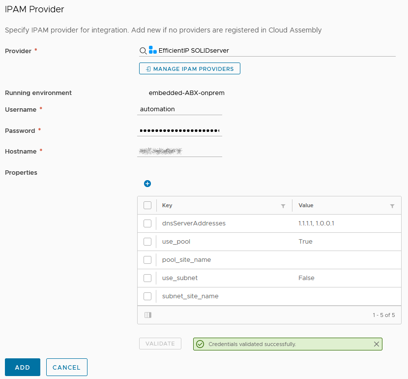

EfficientIP SOLIDserver integration for vRA 8
=============================================

A plugin to integrate [EfficientIP's SOLIDserver](https://www.efficientip.com/products/solidserver/) IPAM with vRealize Automation 8.x and Cloud.

Installation
------------

 - Add a new IPAM Integration in vRealize Automation
 - Upload the latest [Release](https://github.com/JuliaLblnd/vRA-8-SOLIDserver-Plugin/releases) to IPAM Providers
 - Provide the **Username**, **Password**, and **Hostname** of your SOLIDserver Appliances

Usage
-----

You must create IP *pools* in SOLIDserver IPAM.

Additional Configuration Properties
-----------------------------------

### `dnsServerAddresses` :

DNS servers added to the network ranges.

Comma separated IPv4, not mandatory

### `site_name` :

SOLIDserver IPAM *Space* name

Not mandatory

License
-------

This project is licensed under [CeCILL](https://cecill.info/) license - see the [LICENSE](./LICENSE) file for details
